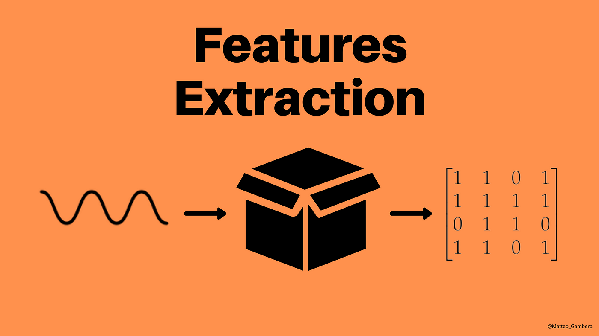

# Network Anomaly Detection App

This Streamlit application provides an interactive interface for detecting network anomalies using a pre-trained XGBoost model.

## Features

- Upload and analyze network traffic data and transform it into a CSV format
- Visualize anomaly detection results with interactive plots
- View feature importance to understand what drives anomaly detection
- Advanced analysis options for deeper investigation
- Export results for further analysis

## Setup Instructions

### Prerequisites

- Python 3.8 or higher.
- pip package manager.

### Installation

1. Clone this repository or download the files
2. Install the required dependencies:

```bash
pip install -r requirements.txt
```

### Running the Application

1. Make sure your trained model and scaler files are in the `outputs` directory:
   - `outputs/xgboost_model.pkl`
   - `outputs/scaler.pkl`

2. Launch the Streamlit app:

```bash
streamlit run app.py
```

3. Open your web browser and navigate to `http://localhost:8501`

### Using Your Own Model

If you want to use your own model instead of the default one:

1. In the sidebar, uncheck "Use default model"
2. Upload your model file (.pkl) and scaler file (.pkl)

## Data Format

The application expects CSV data with network traffic features. If the data includes ground truth labels in a column named 'Label', the app will provide evaluation metrics.

## Adjusting Anomaly Detection Threshold

Use the slider in the sidebar to adjust the threshold for anomaly detection. A higher threshold is more conservative (fewer anomalies detected), while a lower threshold is more sensitive (more anomalies detected).

## Advanced Analysis

Check the "Show advanced analysis" box in the sidebar to access:

- Feature selection for visualization
- Anomaly probability distribution
- Detailed feature importance ranking
- Additional visualization options

## Troubleshooting

- If you encounter "Feature names mismatch" errors, ensure your input data has the same features as those used to train the model
- For "Module not found" errors, verify all dependencies are installed via `requirements.txt`
- If the application fails to load the model, check that your model and scaler files are in the correct format and location

## Try Our Product 
https://networktrafficanomalyandthreatclassification.streamlit.app/
## Demo
[](https://drive.google.com/uc?id=1gjuDRZkXfon3UsV7E09k12OF-ZhDuRP-&export=preview)

https://drive.google.com/file/d/1gjuDRZkXfon3UsV7E09k12OF-ZhDuRP-/view?usp=drive_link

## Features Extraction
[](https://drive.google.com/uc?id=1FTj9hI1c24Aktpse-pyRYWG9msSMGr8l&export=preview)

https://drive.google.com/file/d/1FTj9hI1c24Aktpse-pyRYWG9msSMGr8l/view?usp=drive_link

## Topology 
[](https://drive.google.com/uc?id=120SUjuIBUJ7xOo85IzYH7atu_qpldZT2&export=preview)

https://drive.google.com/file/d/120SUjuIBUJ7xOo85IzYH7atu_qpldZT2/view?usp=drive_link

